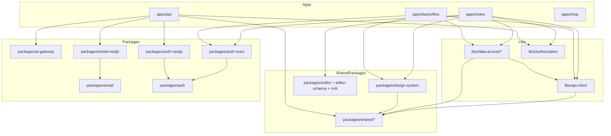

# Knowtis Architecture

Overview of the Knowtis monorepo: structure, tech stack, application layering, data flow, real-time collaboration, the copilot agent, and quality tooling. Every path and symbol below exists in the repo; when something here disagrees with the code, the code wins and this file should be fixed.

---

## Table of Contents

1. [System Overview](#system-overview)
2. [Monorepo Structure](#monorepo-structure)
3. [Tech Stack](#tech-stack)
4. [Application Architecture](#application-architecture)
5. [Data Flow](#data-flow)
6. [Real-time Collaboration](#real-time-collaboration)
7. [Copilot Agent](#copilot-agent)
8. [Authentication Flow](#authentication-flow)
9. [Design Principles](#design-principles)
10. [Quality & Tooling](#quality--tooling)

---

## System Overview

Knowtis is a full-stack collaborative notes platform consisting of:

```
┌─────────────────────────────────────────────────────────────────┐
│                        CLIENT LAYER                             │
│  ┌────────────────────────────────┐ ┌────────────────────────┐  │
│  │       Notes App (React)        │ │   Backoffice (React)   │  │
│  │  • Rich text editing (Tiptap)  │ │  • Admin-only (RBAC)   │  │
│  │  • Real-time collab (Yjs)      │ │  • AI Config & Metrics │  │
│  │  • Offline support (IndexedDB) │ │  • Users, flags, audit │  │
│  │  • Copilot dock + Study tabs   │ │                        │  │
│  └────────────────────────────────┘ └────────────────────────┘  │
├─────────────────────────────────────────────────────────────────┤
│                       TRANSPORT LAYER                           │
│   HTTP/REST (/api/v1)                                           │
│   WebSocket: Hocuspocus on /collaboration (raw WS, y-protocols) │
│              Socket.io namespaces /ai and /agent                │
├─────────────────────────────────────────────────────────────────┤
│                        SERVER LAYER                             │
│  ┌───────────────────────────────────────────────────────────┐  │
│  │                    API (NestJS) v1                        │  │
│  │  • Authentication (JWT + HttpOnly refresh cookie)         │  │
│  │  • Authorization (CASL)                                   │  │
│  │  • Notes CRUD (logical delete + restore), tags, search    │  │
│  │  • AI Assistant (streaming) + Copilot agent (HITL)        │  │
│  │  • Study Artifacts (flashcards, quizzes, summaries)       │  │
│  │  • Collaboration (Hocuspocus + Yjs persistence)           │  │
│  │  • Feature Flags (DB-backed, in-process cache, 30s)       │  │
│  │  • OAuth 2.1 authorization server (oidc-provider, MCP)    │  │
│  │  • MCP API key exchange                                   │  │
│  │  • Admin (user management, AI metrics, audit log)         │  │
│  │  • Health checks & Observability (Langfuse)               │  │
│  └───────────────────────────────────────────────────────────┘  │
├─────────────────────────────────────────────────────────────────┤
│                         DATA LAYER                              │
│  ┌──────────────────────┐    ┌──────────────────────────────┐   │
│  │ PostgreSQL 16        │    │ Redis 7                      │   │
│  │ (pgvector/pgvector:  │    │ • AI rate limiting (RPM)     │   │
│  │  pg16, `vector` ext) │    │ • AI response cache          │   │
│  │ 27 tables, see       │    │ • Agent HITL pending         │   │
│  │ apps/api/src/        │    │   proposals                  │   │
│  │ database/schema/     │    │ • Hocuspocus multi-instance  │   │
│  │ (users, notes, tags, │    │   sync (extension-redis)     │   │
│  │  sessions, artifacts,│    │                              │   │
│  │  conversations, ...) │    │                              │   │
│  └──────────────────────┘    └──────────────────────────────┘   │
└─────────────────────────────────────────────────────────────────┘
```

Sessions are stored in the Postgres `sessions` table (`apps/api/src/modules/auth/infrastructure/persistence/drizzle-session.repository.ts`), not in Redis. Feature flags use NestJS `CacheModule.register()` (in-process, 30s TTL) in `apps/api/src/modules/feature-flags/`; they never touch Redis.

---

## Monorepo Structure

This project uses **Nx** to organize code into a monorepo. This approach improves maintainability, encourages code reuse, and enforces clear boundaries.

### Apps vs Libs

The codebase is strictly divided into **Apps** (deployable units) and **Libs** (shared code):

```
knowtis/
├── apps/                    # Deployable applications
│   ├── api/                 # Backend (NestJS)
│   ├── backoffice/          # Admin frontend (React) — superadmin/ops surface
│   ├── mcp/                 # MCP server for AI assistants (Hono, no workspace deps)
│   └── notes/               # Frontend (React)
│
├── libs/                    # App-specific libraries (not publishable)
│   ├── api-client/          # HTTP/WebSocket client
│   ├── authorization/       # CASL permission definitions
│   └── data-access/         # React Query hooks + Zod schemas per domain
│       ├── admin/           # Backoffice hooks & schemas (users, metrics, config, audit)
│       ├── artifacts/       # Study artifacts hooks
│       ├── feature-flags/   # Feature flags hooks
│       ├── mcp-keys/        # MCP API keys hooks & schemas
│       ├── notes/           # Notes, tags, organization, image-upload hooks
│       ├── oauth/           # OAuth consent/grants hooks & schemas
│       └── users/           # Users hooks & schemas
│
└── packages/                # Shared packages (framework-light, reusable)
    ├── ai-gateway/          # Framework-free AI gateway core (chain, catalog, guard, tokens)
    ├── auth/                # Auth core (+ /server): types, value objects, token/crypto
    ├── auth-nestjs/         # NestJS auth adapter (handlers, guards, strategies)
    ├── auth-react/          # React auth integration (store, hooks, provider)
    ├── crdt/                # Yjs/CRDT helpers & shared types
    ├── design-system/       # UI components & design tokens (Storybook)
    ├── editor/              # Collaborative Tiptap + Yjs editor
    ├── editor-schema/       # Tiptap schema extensions (Mermaid, semantic nodes)
    ├── email/               # React Email templates (i18n)
    ├── email-nestjs/        # NestJS email module (Resend/Console adapters)
    ├── permissions/         # CASL-wrapped permission core
    ├── permissions-nestjs/  # NestJS permission guards & decorators
    ├── permissions-react/   # React permission hooks
    └── shared/              # Common utilities
        ├── hooks/           # Generic React hooks
        ├── i18n/            # Internationalization
        ├── types/           # Shared TypeScript types
        └── util/            # Utility functions
```

### Library Categories

| Category          | Path                                                              | Description                                                               |
| ----------------- | ----------------------------------------------------------------- | ------------------------------------------------------------------------- |
| **API Client**    | `libs/api-client`                                                 | HTTP client, WebSocket client, API types                                  |
| **Authorization** | `libs/authorization`                                              | CASL permission definitions (shared FE/BE)                                |
| **Data Access**   | `libs/data-access/*`                                              | React Query hooks + Zod schemas per domain (see below)                    |
| **AI Gateway**    | `packages/ai-gateway`                                             | AI gateway core: fallback chain, pricing catalog, injection guard, tokens |
| **Auth**          | `packages/auth`, `auth-nestjs`, `auth-react`                      | Auth core + NestJS/React adapters (JWT, sessions, anon)                   |
| **Permissions**   | `packages/permissions`, `permissions-nestjs`, `permissions-react` | CASL core + NestJS/React adapters                                         |
| **Editor / CRDT** | `packages/editor`, `editor-schema`, `crdt`                        | Collaborative Tiptap + Yjs editor, schema extensions, CRDT helpers        |
| **Email**         | `packages/email`, `email-nestjs`                                  | React Email templates + NestJS delivery adapter                           |
| **Design System** | `packages/design-system`                                          | UI components, design tokens, styles                                      |
| **Shared**        | `packages/shared/*`                                               | Hooks, i18n, utilities, TypeScript types                                  |

#### Data access libraries

The `libs/data-access/*` libraries wrap `@knowtis/api-client` in React Query hooks so components never call the API directly. Client-side Zustand stores are **not** here: they live in `apps/notes/src/stores/` and `packages/auth-react`. Each library follows the same shape: `useXxx` hooks (`useQuery` for reads, `useMutation` for writes), a hierarchical `xxxQueryKeys` factory, and co-located Zod schemas where a domain needs input validation. Exports below are read from each `src/index.ts`.

| Library                          | Alias                                | Scope              | Key exports                                                                                                   |
| -------------------------------- | ------------------------------------ | ------------------ | ------------------------------------------------------------------------------------------------------------- |
| `libs/data-access/admin`         | `@knowtis/data-access-admin`         | `scope:backoffice` | `useAdminUsers`, `useAuditLog`, `useAiConfig`, `useSystemProviders`, `useUpsertFeatureFlag`, `adminQueryKeys` |
| `libs/data-access/artifacts`     | `@knowtis/data-access-artifacts`     | `scope:notes`      | `useArtifacts`, `useGenerateArtifact`, `useDueCards`, `useReviewCard`, `useSubmitQuiz`, `artifactsQueryKeys`  |
| `libs/data-access/feature-flags` | `@knowtis/data-access-feature-flags` | `scope:shared`     | `useFeatureFlags`, `useFeatureFlag`, `featureFlagsQueryKeys`                                                  |
| `libs/data-access/mcp-keys`      | `@knowtis/data-access-mcp-keys`      | `scope:shared`     | `useMcpKeys`, `useCreateMcpKey`, `useRevokeMcpKey`, `createMcpKeySchema`, `mcpKeysQueryKeys`                  |
| `libs/data-access/notes`         | `@knowtis/data-access-notes`         | `scope:notes`      | `useNotes`, `useNote`, `useCreateNote`, `useRestoreNote`, `useTags`, `useUploadImage`, `notesQueryKeys`       |
| `libs/data-access/oauth`         | `@knowtis/data-access-oauth`         | `scope:notes`      | `useOauthInteraction`, `useConsentDecision`, `useOauthGrants`, `useRevokeGrant`, `classifyConsentError`       |
| `libs/data-access/users`         | `@knowtis/data-access-users`         | `scope:shared`     | `useUpdateProfile`, `usersQueryKeys`, `UpdateProfileSchema`                                                   |

Run `nx test data-access-<name>` for a single library.

### Dependency Rules

Projects are tagged with `type:` tags and follow a tag-based hierarchy, enforced via `@nx/enforce-module-boundaries` in `eslint.config.js`:

```
type:app  (can import any library type)
  ↓
type:ui  ───────────────►  type:util
(can import type:ui + type:util)      ↑
  ↓                                    │
type:data-access  ───────────────────┘
(can import type:data-access + type:util)
```

- **`type:app`** — applications; may depend on `type:ui`, `type:data-access`, `type:util`.
- **`type:ui`** — UI libraries (`design-system`, `editor`, `crdt`); may depend on `type:ui` and `type:util` only. Cannot reach into `type:data-access` or `type:app`.
- **`type:data-access`** — state/API access; may depend on `type:data-access` and `type:util`. `api-client` is itself `type:data-access`.
- **`type:util`** — pure utilities; may depend on `type:util` only.

Note: `design-system` is `type:ui` and is **not** part of the data-access import chain; `api-client` is `type:data-access`, not a separate tier. Scope constraints apply on top of these type rules: `scope:shared` may be used by anyone; `scope:notes`, `scope:api`, and `scope:backoffice` may only depend on `scope:shared` or their own scope.

### Dependency Graph

Simplified; `pnpm graph` renders the full graph.



`apps/mcp` (`scope:api`) has no workspace imports; it talks to the API over HTTP. `packages/ai-gateway` (`scope:api`) has zero workspace dependencies by design.

---

## Tech Stack

Versions are the ranges declared in the root `package.json`.

### Frontend (Notes App, Backoffice)

| Technology      | Version | Purpose                 |
| --------------- | ------- | ----------------------- |
| React           | 19      | UI framework            |
| Vite            | 7       | Build tool & dev server |
| TanStack Router | 1.x     | Type-safe routing       |
| TanStack Query  | 5.x     | Server state management |
| Zustand         | 5       | Client state management |
| Tiptap          | 3       | Rich text editor        |
| Yjs             | 13      | CRDT for real-time sync |
| Tailwind CSS    | 4       | Styling                 |

### Backend (API)

| Technology           | Version                       | Purpose                                                                                                                                                                                                   |
| -------------------- | ----------------------------- | --------------------------------------------------------------------------------------------------------------------------------------------------------------------------------------------------------- |
| NestJS               | 11                            | Server framework                                                                                                                                                                                          |
| Drizzle ORM          | 0.45                          | Type-safe database ORM                                                                                                                                                                                    |
| PostgreSQL           | 16 (`pgvector/pgvector:pg16`) | Primary database; `vector` extension required                                                                                                                                                             |
| Redis                | 7 (`ioredis` 5)               | AI rate limiting/cache, HITL proposals, Hocuspocus multi-instance                                                                                                                                         |
| Hocuspocus           | 4                             | Yjs WebSocket sync server                                                                                                                                                                                 |
| Socket.io            | 4.8                           | `/ai` and `/agent` streaming namespaces                                                                                                                                                                   |
| Vercel AI SDK (`ai`) | 7                             | LLM streaming; providers `@ai-sdk/anthropic`, `@ai-sdk/google`, `@ai-sdk/openai`, `@openrouter/ai-sdk-provider`. Code defaults route through OpenRouter (`apps/api/src/modules/ai/domain/ai-settings.ts`) |
| oidc-provider        | 9.8                           | OAuth 2.1 authorization server for MCP clients                                                                                                                                                            |
| Passport             | 0.7                           | Authentication middleware                                                                                                                                                                                 |
| bcryptjs             | 3                             | Password hashing                                                                                                                                                                                          |
| class-validator      | 0.14                          | Request validation (DTO)                                                                                                                                                                                  |
| neverthrow           | 8                             | Result type error handling                                                                                                                                                                                |
| Pino                 | 10                            | Structured logging                                                                                                                                                                                        |
| @nestjs/terminus     | 11                            | Health checks                                                                                                                                                                                             |
| @nestjs/schedule     | 6                             | Scheduled tasks (auth cleanup, catalog sync, agent health report, memory extraction)                                                                                                                      |
| Helmet               | 8                             | Security headers                                                                                                                                                                                          |
| Swagger/OpenAPI      | 11                            | API documentation                                                                                                                                                                                         |

### Tooling

| Tool             | Purpose                                                                        |
| ---------------- | ------------------------------------------------------------------------------ |
| Nx               | Monorepo management & task running                                             |
| TypeScript       | Type safety (5.9)                                                              |
| ESLint           | Code linting (flat config)                                                     |
| Prettier         | Code formatting                                                                |
| Vitest           | Unit & integration testing (4)                                                 |
| Lefthook         | Git hooks: lint, format, typecheck, auto-generate migrations, test, commit-msg |
| Storybook        | Component documentation                                                        |
| Style Dictionary | Design token generation                                                        |

---

## Application Architecture

### Frontend Architecture

Provider order is `apps/notes/src/providers/AppProviders.tsx`; pages are `apps/notes/src/pages/`.

```
┌─────────────────────────────────────────────────────────────┐
│                         App Shell                           │
│  ┌───────────────────────────────────────────────────────┐  │
│  │  Providers (outer → inner)                            │  │
│  │  PostHogProvider > QueryClientProvider > AuthProvider │  │
│  │  > ThemeProvider > TooltipProvider > AbilityProvider  │  │
│  │  > YjsProvider                                        │  │
│  └───────────────────────────────────────────────────────┘  │
│                           ↓                                 │
│  ┌───────────────────────────────────────────────────────┐  │
│  │  Router — TanStack Router, file-based routes in       │  │
│  │  apps/notes/src/routes/ (`_app` layout guards auth)   │  │
│  └───────────────────────────────────────────────────────┘  │
│                           ↓                                 │
│  ┌───────────────────────────────────────────────────────┐  │
│  │  Pages                                                │  │
│  │  HomePage, NoteEditorPage, SharedNotePage,            │  │
│  │  WelcomePage, LoginPage, RegisterPage,                │  │
│  │  ForgotPasswordPage, ResetPasswordPage,               │  │
│  │  VerifyEmailPage                                      │  │
│  └───────────────────────────────────────────────────────┘  │
│                           ↓                                 │
│  ┌───────────────────────────────────────────────────────┐  │
│  │  Feature components (apps/notes/src/components/)      │  │
│  │  editor/CollaborativeEditor, notes/NoteList,          │  │
│  │  notes/NoteCard, notes/ShareDialog, copilot/,         │  │
│  │  artifacts/, right-dock/, settings/                   │  │
│  │  EditorToolbar lives in packages/editor               │  │
│  └───────────────────────────────────────────────────────┘  │
│                           ↓                                 │
│  ┌───────────────────────────────────────────────────────┐  │
│  │  Design System (packages/design-system)               │  │
│  │  Button, Input, Card, Dialog, ...; design tokens      │  │
│  └───────────────────────────────────────────────────────┘  │
└─────────────────────────────────────────────────────────────┘
```

### Backend Architecture (Modular DDD)

The backend is a **modular monolith**. `apps/api/src/modules/` holds 17 modules: `admin`, `agent`, `ai`, `artifacts`, `auth`, `authorization`, `collaboration`, `feature-flags`, `health`, `mcp`, `notes`, `oauth`, `observability`, `organization`, `search`, `users`, `websocket`.

`notes`, `ai`, `agent`, and `artifacts` are DDD-layered (`application/`, `domain/`, `infrastructure/`). `auth` has `application/services` and `infrastructure/` only: its domain (entities, value objects, token crypto) lives in `packages/auth` and `packages/auth-nestjs`. The rest are service-based. Patterns (neverthrow `Result`, ports & adapters, value objects) are described in [apps/api/README.md → Patterns](../apps/api/README.md#patterns).

```
┌─────────────────────────────────────────────────────────────┐
│                      NestJS Application                     │
│                                                             │
│  ┌───────────────────────────────────────────────────────┐  │
│  │  Controllers — 25 (`rg @Controller apps/api/src`)     │  │
│  │  e.g. AuthAccountController, AuthSessionController,   │  │
│  │  NotesController, TagsController, SearchController,   │  │
│  │  AIController, ArtifactsController, AdminController,  │  │
│  │  McpKeysController, OauthGrantsController             │  │
│  │  Gateways — AIGateway (/ai), AgentGateway (/agent)    │  │
│  └───────────────────────────────────────────────────────┘  │
│                           ↓                                 │
│  ┌───────────────────────────────────────────────────────┐  │
│  │  Application Layer                                    │  │
│  │  • Command handlers (CreateNoteHandler, ShareNote...) │  │
│  │  • Query handlers (GetNoteHandler, GetNotesHandler)   │  │
│  │  • AI orchestration (streaming, rate limiting)        │  │
│  │  • Agent turn loop + HITL approve/reject handlers     │  │
│  │  • Artifact generation                                │  │
│  │  • Authorization (CASL ability factory)               │  │
│  └───────────────────────────────────────────────────────┘  │
│                           ↓                                 │
│  ┌───────────────────────────────────────────────────────┐  │
│  │  Domain Layer                                         │  │
│  │  • Entities (Note), events (NoteCreated, NoteUpdated) │  │
│  │  • Value Objects (NoteTitle, NoteContent, TagPath)    │  │
│  │  • Ports (NoteReadRepository, NoteWriteRepository,    │  │
│  │    TagRepository, ImageStorage, ...)                  │  │
│  └───────────────────────────────────────────────────────┘  │
│                           ↓                                 │
│  ┌───────────────────────────────────────────────────────┐  │
│  │  Infrastructure Layer                                 │  │
│  │  • Drizzle adapters (DrizzleNoteReadRepository, ...)  │  │
│  │  • VercelBlobStorage, Redis stores, AI providers      │  │
│  └───────────────────────────────────────────────────────┘  │
└─────────────────────────────────────────────────────────────┘
```

---

## Data Flow

### Read Operations (Query)

```
User Action (view notes)
       ↓
Page Component
       ↓
useNotes() hook (@knowtis/data-access-notes)
       ↓
API Client (@knowtis/api-client)
       ↓
HTTP GET /api/v1/notes
       ↓
NotesController
       ↓
GetNotesHandler.execute() (application/queries/get-notes.handler.ts)
       ↓
NoteRepository.findAccessibleByUser() (domain port)
       ↓
DrizzleNoteRepository (infrastructure adapter)
       ↓
Drizzle ORM → PostgreSQL
       ↓
Response mapped to DTO
```

### Write Operations (Command)

```
User Action (create note)
       ↓
useCreateNote() mutation
       ↓
HTTP POST /api/v1/notes
       ↓
NotesController
       ↓
CreateNoteHandler.execute() (application/commands/create-note.handler.ts)
       ↓
NoteTitle.create() / NoteContent.create() (domain validation)
       ↓
NOTE_WRITE_REPOSITORY port → DrizzleNoteWriteRepository
       ↓
PostgreSQL
       ↓
React Query cache update
```

---

## Real-time Collaboration

### CRDT Architecture

We use [Yjs](https://yjs.dev/) for conflict-free real-time collaboration. The server side is a Hocuspocus instance mounted on the API's HTTP server for the `/collaboration` upgrade path (`apps/api/src/modules/collaboration/hocuspocus.service.ts`). There is no NestJS gateway for collaboration; Hocuspocus speaks the binary y-protocols sync and awareness messages directly.

```
┌─────────────┐    ┌──────────────┐    ┌─────────────┐
│   User A    │    │    Server    │    │   User B    │
│             │    │              │    │             │
│  ┌───────┐  │    │ ┌──────────┐ │    │  ┌───────┐  │
│  │ Y.Doc │←───────→│Hocuspocus│←───────→│ Y.Doc │  │
│  └───────┘  │    │ └──────────┘ │    │  └───────┘  │
│      ↓      │    │      ↓       │    │      ↓      │
│  ┌───────┐  │    │  PostgreSQL  │    │  ┌───────┐  │
│  │Tiptap │  │    │  (yjs state) │    │  │Tiptap │  │
│  └───────┘  │    │              │    │  └───────┘  │
│      ↓      │    │              │    │      ↓      │
│  IndexedDB  │    │              │    │  IndexedDB  │
└─────────────┘    └──────────────┘    └─────────────┘
```

### Synchronization Flow

1. User edits → Tiptap updates the `Y.Doc`.
2. `Y.Doc` emits a binary update (`Uint8Array`).
3. `HocuspocusProvider` sends it over the `/collaboration` WebSocket; the token is supplied through the provider's `token` callback (`apps/notes/src/collaboration/useHocuspocusCollaboration.ts`).
4. The server applies it to the room document, persists it (`HocuspocusPersistenceExtension`), and broadcasts to other clients.
5. Clients merge automatically (CRDT); Tiptap re-renders.

With `REDIS_URL` set, Hocuspocus adds `@hocuspocus/extension-redis` so several API instances share rooms; without it the server runs single-instance.

### Offline and cross-tab

`packages/crdt/src/YjsProvider.tsx` always attaches an `IndexeddbPersistence` (`note-<noteId>`) to each document and relays updates between tabs of the same browser over a `BroadcastChannel`, independent of the server connection.

`VITE_COLLABORATION_MODE` decides whether the Hocuspocus connection is opened at all: `websocket` or `hybrid` turns it on; any other value keeps the editor local-only (`isWebSocketEnabled()` in `useHocuspocusCollaboration.ts`). Production must set `websocket`.

### Presence (Awareness)

Awareness carries two separate fields: `user` (set in `YjsProvider.tsx`) and `cursor` (set by `packages/editor/src/components/CollaborativeCursors.tsx` from the ProseMirror selection).

```typescript
awareness.setLocalStateField('user', { name, color });
awareness.setLocalStateField('cursor', { anchor, head });
```

---

## Copilot Agent

The **copilot** is a conversational, tool-using agent that lives in its own `agent` NestJS module — distinct from the `ai` module, which serves single-shot editor completions. It talks to the client over a dedicated Socket.io namespace (`/agent`) and shares the framework-free `@knowtis/ai-gateway` core (provider fallback chain, prompt-injection guard, token costing) with every other AI path.

### Agent loop

Each turn runs an **agent-owned step loop** (`agent-step-loop.ts`, driven from `run-agent-turn.handler.ts`): one `streamText` call per step, each step's tool results threaded into the next call's history, so every LLM call is independently budgeted. A call gets its own TTFT budget (`AI_AGENT_TTFT_MS`), stream-silence budget (`AI_AGENT_STALL_MS` — the operative limit; a reasoning model may legitimately work for minutes, so the loop bounds _silence_, not elapsed time), and the turn is capped by `AI_AGENT_MAX_STEPS`, `AI_AGENT_MAX_OUTPUT_TOKENS`, `AI_AGENT_TURN_TOKEN_BUDGET` (provider-measured tokens accumulated across steps), and the `AI_AGENT_MAX_MS` wall-clock backstop. `agent:done` carries a `stopReason` so the client can tell a natural completion from a cap.

Owning the loop is what makes **step-boundary failover** possible: a continuation step whose model goes silent fails over mid-turn to the next fallback-chain candidate, replaying the threaded history (pruned of the dead model's reasoning) on the new model without re-executing tools. Stream health telemetry (`agent.turn.health`) is logged per call. Tools are organized as flag-gated **tool groups** resolved per turn, so retrieval, web search, and write capabilities toggle independently. Full semantics: [AI.md → Conversation memory (A6a)](./AI.md#conversation-memory-a6a).

The persisted transcript carries more than final text: each row can hold structured `parts` (a versioned jsonb envelope) alongside plain `content`, a terminal assistant row carries its `stop_reason` whenever the turn ends on assistant text, and a truncated reply (`aborted | error | length`) is always replayed with a `[reply cut off: <reason>]` marker so the model treats its own cutoff as data on the next turn. The last two tool-using turns are replayed verbatim — tool calls and results included, not just their final text — while every older turn is rendered as text-only history; the row window counts tool rows (see `docs/AI.md` for the exact boundary).

### Server-authoritative & human-in-the-loop

The agent is **server-authoritative**: the client sends one new message plus a `conversationId` — optionally the `noteId` in view, a `model`, and a per-turn reasoning `effort` — never its own history. The server rebuilds the thread from Postgres each turn.

Mutations (`create` / `update` / `share`, see `agent/domain/proposed-mutation.ts`) never execute directly. The model emits a **proposal**; the server parks it in Redis (`RedisPendingMutationStore`) and pushes it to the client for **approval**. Only on `agent:approve` does the server commit the change and resume the turn — a strict human-in-the-loop (HITL) gate that an MCP-scoped token cannot bypass. `agent:reject` discards it.

```
agent:message ──▶ load thread ──▶ tool loop ──▶ propose mutation
                                                       │
client  ◀── agent:proposal ────────────────────────────┘
   │
   └─ agent:approve ──▶ commit ──▶ agent:committed ──▶ resume ──▶ agent:done
```

### Memory & retrieval layers

| Layer                      | Description                                                                                                                                                                                              |
| -------------------------- | -------------------------------------------------------------------------------------------------------------------------------------------------------------------------------------------------------- |
| **Thread memory (A6a)**    | Per-conversation history in `conversations` / `conversation_messages`, reconstructed server-side every turn. Always on with `ai_enabled`, the verbatim replay of the last two tool-using turns included. |
| **Long-term memory (A6b)** | Durable, userId-scoped facts extracted from idle conversations by a cron and recalled per turn via pgvector. Flag `agent_longterm_memory`.                                                               |
| **Hybrid retrieval (A3)**  | The `searchNotes` tool fuses Postgres FTS with a pgvector KNN leg via Reciprocal Rank Fusion. Flag `agent_hybrid_retrieval`.                                                                             |
| **Web search (A4)**        | `webSearch` / `webFetch` tools behind an agnostic provider port (Tavily). Flag `agent_web_search`.                                                                                                       |

All retrieved content — notes, memories, and web results — is injected into the prompt as **DATA**, passed through the injection guard, and never treated as instructions.

See [AI Module → Conversation memory (A6a)](./AI.md#conversation-memory-a6a) and the surrounding sections for the full schema, feature flags, and environment variables.

### Model selection & billing (BYOK)

The copilot model is resolved per turn through a cascade (conversation model → user preferred model → user intent → system default) over a catalog of curated plus admin-promoted models; BYOK keys unlock a provider's models and bill the user directly. Details: [AI.md → Copilot Model Selection](./AI.md#copilot-model-selection), [Reasoning effort](./AI.md#reasoning-effort), and [Bring-your-own-key (BYOK)](./AI.md#bring-your-own-key-byok).

---

## Authentication Flow

Full reference: [AUTH.md](./AUTH.md).

Login and register (`apps/api/src/modules/auth/auth-session.controller.ts`) return `{ user, tokens: { accessToken } }` in the body and set the refresh token as an HttpOnly cookie scoped to `path=/api/v1/auth` — `rid` for the notes app, `rid_bo` for the backoffice (`modules/auth/utils/cookie.utils.ts`), so the two frontends never share a session. Requests carry `Authorization: Bearer <accessToken>`. `POST /api/v1/auth/refresh` reads the cookie, rotates the session, sets a new cookie, and returns `{ accessToken }`. `GET /api/v1/auth/me` returns `{ user: req.user }` straight from the JWT guard (`auth-account.controller.ts`).

On the client, `libs/api-client/src/lib/session-refresh.ts` makes refresh single-flight within a tab and serializes it across tabs with the Web Lock `knowtis-auth-refresh`, so a rotating refresh token is never consumed twice. There is no request queue; a 401 triggers one refresh and the failed request is retried.

---

## Design Principles

### SOLID Principles

| Principle                 | Application                                        |
| ------------------------- | -------------------------------------------------- |
| **Single Responsibility** | Each module/component has one reason to change     |
| **Open/Closed**           | Components extensible via props, not modification  |
| **Liskov Substitution**   | Subtypes (e.g., Button variants) are substitutable |
| **Interface Segregation** | Small, focused interfaces (hooks, props)           |
| **Dependency Inversion**  | Components depend on abstractions (hooks/stores)   |

### Additional Principles

- **DRY** - Logic extracted into shared libraries or hooks
- **KISS** - Simple, readable solutions over complex engineering
- **Composition over Inheritance** - UI built by composing small components
- **Colocation** - Related code lives together (component + test + styles)
- **Type Safety** - TypeScript strict mode, runtime validation with Zod

### Naming Conventions

| Type       | Convention                     | Example                   |
| ---------- | ------------------------------ | ------------------------- |
| Components | PascalCase                     | `NoteCard.tsx`            |
| Hooks      | camelCase with `use` prefix    | `useNotes.ts`             |
| Stores     | camelCase with `.store` suffix | `agent.store.ts`          |
| Utils      | camelCase                      | `formatDate.ts`           |
| Types      | PascalCase                     | `Note`, `CreateNoteInput` |
| Constants  | SCREAMING_SNAKE_CASE           | `MAX_TITLE_LENGTH`        |

---

## Quality & Tooling

### TypeScript Configuration

`tsconfig.base.json` enables strict mode plus:

```json
{
  "compilerOptions": {
    "strict": true,
    "noUnusedLocals": true,
    "noUnusedParameters": true,
    "noFallthroughCasesInSwitch": true,
    "noUncheckedSideEffectImports": true,
    "noImplicitReturns": true,
    "noImplicitOverride": true,
    "exactOptionalPropertyTypes": true,
    "erasableSyntaxOnly": true,
    "verbatimModuleSyntax": true
  }
}
```

### Linting & Formatting

- **ESLint** - Modern flat config with React and TypeScript rules. The root `eslint.config.js` is the single source of rules; projects that need `@nx/dependency-checks` (the publishable packages, `libs/api-client`, `libs/authorization`, `packages/shared/types` and `apps/api`) ship a thin `eslint.config.mjs` that spreads it. Because Nx runs each inferred `lint` target as `eslint .` from the project directory, the root's path-scoped blocks (React hooks + a11y for `apps/notes`, `apps/backoffice`, `libs`, `packages`; NestJS overrides for `apps/api` and `packages/*-nestjs`) carry `basePath: workspaceRoot` so their globs keep matching when imported from a subdirectory. `pnpm lint:config` (`tools/__tests__/eslint-config.test.mjs`, run in CI before lint) asserts those blocks resolve from every project that has its own config.
- **Prettier** - Consistent formatting with import sorting

### Testing Strategy

| Layer       | Focus                                           | Tools                                                                          |
| ----------- | ----------------------------------------------- | ------------------------------------------------------------------------------ |
| Unit        | Business logic, utilities                       | Vitest                                                                         |
| Component   | UI interaction, rendering                       | React Testing Library                                                          |
| Integration | Handlers and repositories against real Postgres | Vitest, `*.db.spec.ts` (own sequential project in `apps/api/vitest.config.ts`) |

### CI/CD Pipeline

The project uses GitHub Actions (`.github/workflows/ci.yml`) with **Nx affected** — only projects a change touches are linted, typechecked, tested, and built.

**Triggers:** pushes to `main`/`develop`, and pull requests whose **base** branch is `main`, `develop`, or any Conventional-prefixed feature branch (`feat/**`, `fix/**`, …) — the latter so stacked PRs run CI against their parent branch instead of showing up with no checks. For stacked PRs, `nx-set-shas` computes affected against the PR's real base ref (`git merge-base origin/<base> HEAD`), so each level only re-verifies its own changes.

**CI job** (single job, sequential steps): `pnpm skills:check` → lint → typecheck → apply migrations (`nx db:migrate:run api` against the CI Postgres) → test (`--parallel=2`, hosted runners OOM beyond that) → migration-drift check (`nx db:generate api` must produce no diff) → production build. It then exposes one `*_affected` output per app.

**Deploy jobs** (main push only, each gated on its app being affected):

| Job                 | Target                                                                                                                                 |
| ------------------- | -------------------------------------------------------------------------------------------------------------------------------------- |
| `deploy-frontend`   | Vercel (notes) — `vercel pull/build/deploy --prebuilt --prod`                                                                          |
| `deploy-backoffice` | Vercel (`knowtis-backoffice` project) — same flow with `--local-config apps/backoffice/vercel.json`                                    |
| `deploy`            | Railway (api) — `railway-deploy.sh`, which waits for the deployment's terminal status; migrations run via Railway's pre-deploy command |
| `deploy-mcp`        | Railway (mcp) — pins service vars and asserts OAuth env parity, then the same gated deploy                                             |

**Neither frontend auto-deploys from Vercel's Git integration** — `vercel.json` sets `git.deploymentEnabled: false`; every deploy is CI-driven and gated on the checks above. See [DEPLOYMENT.md](./DEPLOYMENT.md).

### Git hooks (Lefthook)

`lefthook.yml`: pre-commit runs ESLint + Prettier on staged files, `nx affected -t typecheck` (each project's target is `tools/typecheck-project.sh {projectRoot}`, run from the workspace root so it resolves the same way in linked worktrees), and — when a file under `apps/api/src/database/schema/` is staged — `nx db:generate api`, staging any new files under `apps/api/drizzle/`. Pre-push runs `nx affected -t test`. Commit-msg enforces Conventional Commits.

---

## Related Documentation

- [Root README](../README.md) - Quick start & scripts
- [API Documentation](../apps/api/README.md) - Backend details and patterns
- [Notes App Documentation](../apps/notes/README.md) - Frontend details
- [Authentication](./AUTH.md) - Auth flows, cookies, sessions
- [AI Module](./AI.md) - AI assistant, copilot, voice notes
- [MCP Server](./MCP.md) - MCP integration for AI assistants
- [Migrations](./MIGRATIONS.md) - Drizzle migration workflow
- [Deployment Guide](./DEPLOYMENT.md) - Railway & Vercel deployment
